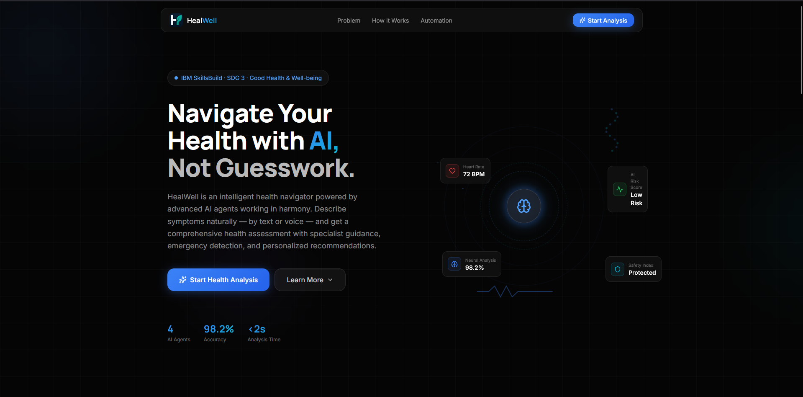
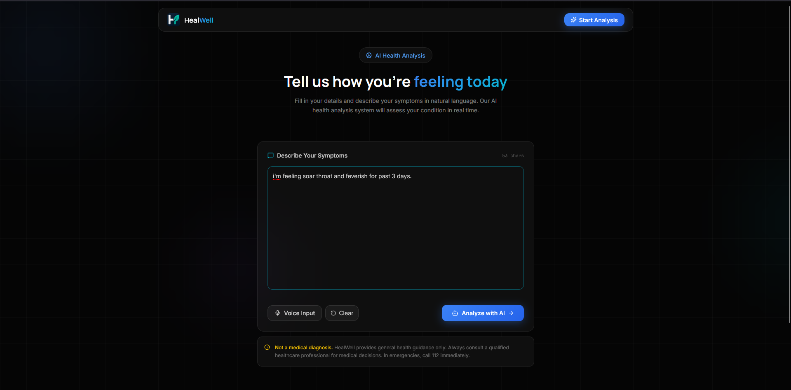
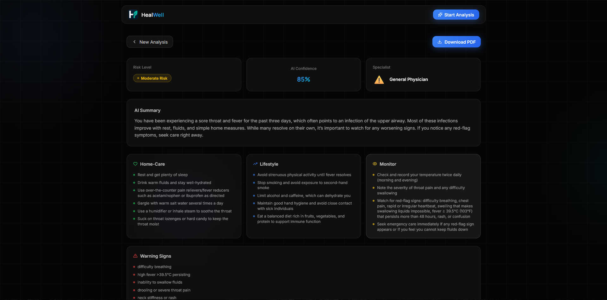
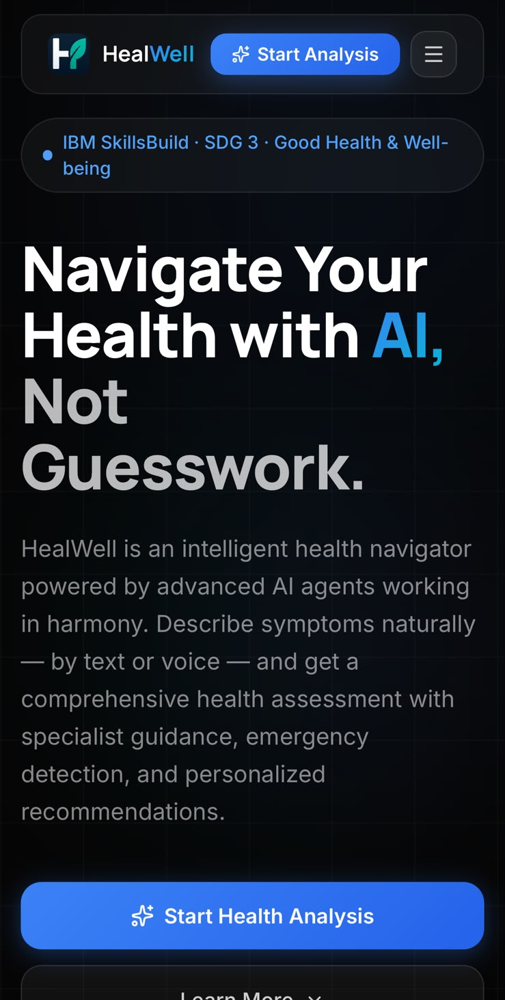
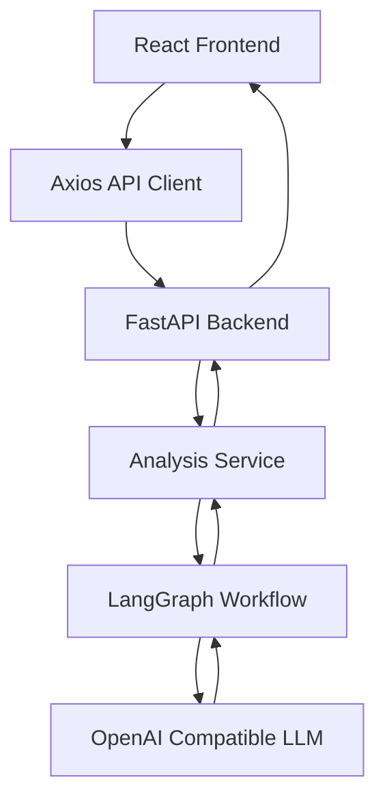
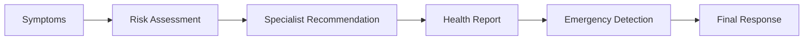

<div align="center">


# HealWell

### AI-Powered Health Analysis Platform

*Intelligent symptom analysis powered by LangGraph, FastAPI, React, and OpenAI-compatible LLMs.*

**Live Demo:** https://heal-well-three.vercel.app

**Backend API:** https://healwell-api.onrender.com

<p>


</p>

---

**HealWell** is a modern AI-powered health analysis platform that helps users better understand their symptoms by providing structured risk assessment, specialist recommendations, emergency detection, and personalized health guidance using a multi-stage LangGraph workflow.

</div>

---

# Table of Contents

- [Overview](#-overview)
- [Features](#-features)
- [Screenshots](#-screenshots)
- [Technology Stack](#-technology-stack)
- [Architecture](#-architecture)
- [AI Workflow](#-ai-workflow)
- [Project Structure](#-project-structure)
- [Getting Started](#-getting-started)
- [Environment Variables](#-environment-variables)
- [API](#-api)
- [Project Milestones](#-project-milestones)
- [Contributing](#-contributing)
- [License](#-license)
- [Medical Disclaimer](#-medical-disclaimer)
- [Acknowledgements](#-acknowledgements)

---

# Overview

HealWell combines modern web technologies with AI to provide users with an intelligent symptom analysis experience.

Instead of simply generating text, HealWell processes symptoms through a structured AI workflow that produces:

- Risk Assessment
- Confidence Score
- Specialist Recommendation
- Emergency Detection
- Personalized Health Report

The application follows a **stateless architecture**, making it lightweight, scalable, and easy to deploy.

---

# Features

## AI Health Analysis

- Intelligent symptom analysis
- Structured risk assessment
- Confidence scoring
- Emergency detection
- Specialist recommendation
- Personalized health report

---

## Health Guidance

- Home care recommendations
- Lifestyle suggestions
- Monitoring advice
- Educational health references

---

## Modern Architecture

- LangGraph workflow orchestration
- FastAPI backend
- React + TypeScript frontend
- Responsive UI
- Stateless backend
- OpenAI-compatible LLM support

---

# Screenshots

> Replace these placeholders with actual screenshots.

| Home | Analysis |
|------|----------|
|  |  |

| Results | Mobile |
|---------|--------|
|  |  |

---

# Technology Stack

## Frontend

- React
- TypeScript
- Vite
- Tailwind CSS
- Framer Motion
- Axios

---

## Backend

- FastAPI
- Python
- Pydantic
- Uvicorn

---

## AI

- LangGraph
- OpenAI Compatible API
- GPT Models

---

# Architecture



---

# AI Workflow



---

# <svg xmlns="http://www.w3.org/2000/svg" width="24" height="24" viewBox="0 0 24 24" fill="none" stroke="currentColor" stroke-width="2" stroke-linecap="round" stroke-linejoin="round" class="lucide lucide-folder-icon lucide-folder"><path d="M20 20a2 2 0 0 0 2-2V8a2 2 0 0 0-2-2h-7.9a2 2 0 0 1-1.69-.9L9.6 3.9A2 2 0 0 0 7.93 3H4a2 2 0 0 0-2 2v13a2 2 0 0 0 2 2Z"/></svg> Project Structure

```
HealWell/
│
├── backend/
│   ├── app/
│   │   ├── ai/
│   │   ├── api/
│   │   ├── core/
│   │   ├── schemas/
│   │   ├── services/
│   │   └── main.py
│   ├── requirements.txt
│   └── .env.example
│
├── frontend/
│   ├── src/
│   ├── public/
│   ├── package.json
│   └── vite.config.ts
│
├── docs/
├── README.md
└── LICENSE
```

---

# Getting Started

## Prerequisites

- Python 3.11+
- Node.js 20+
- npm
- OpenAI-compatible API Key

---

## Clone Repository

```bash
git clone https://github.com/yourusername/healwell.git

cd healwell
```

---

## Backend

```bash
cd backend

python -m venv .venv

source .venv/bin/activate

# Windows

.venv\Scripts\activate

pip install -r requirements.txt

cp .env.example .env

uvicorn app.main:app --reload
```

Backend runs on:

```
http://localhost:8000
```

---

## Frontend

```bash
cd frontend

npm install

npm run dev
```

Frontend runs on:

```
http://localhost:5173
```

---

# Environment Variables

| Variable | Description |
|-----------|-------------|
| LLM_API_KEY | OpenAI-compatible API Key |
| LLM_BASE_URL | OpenAI/OpenRouter/Ollama endpoint |
| LLM_MODEL | Model name |
| API_PREFIX | Backend API prefix |
| FRONTEND_URL | Frontend URL |

---

# API

## Analyze Symptoms

```
POST /api/v1/analysis
```

### Request

```json
{
  "symptoms": "I have had a severe headache and fever for two days."
}
```

---

### Response

```json
{
  "success": true,
  "data": {
    "risk_level": "moderate",
    "confidence": 0.91,
    "specialist": "General Physician",
    "emergency": false,
    "risk_assessment": {},
    "specialist_recommendation": {},
    "health_report": {}
  }
}
```

---

# Project Milestones

## Phase 1 — Foundation

- Initial project setup
- React + FastAPI architecture
- Modern responsive UI
- API integration

---

## Phase 2 — AI Integration

- OpenAI-compatible LLM support
- LangGraph workflow implementation
- Risk assessment engine
- Specialist recommendation system
- Health report generation

---

## Phase 3 — Refinement

- UI/UX improvements
- Responsive layouts
- Loading and error states
- API optimization
- Improved user experience

---

## Phase 4 — Architecture Simplification

- Removed authentication
- Removed database persistence
- Removed analysis history
- Removed doctor finder
- Stateless backend architecture
- OpenAI-only provider
- Complete codebase cleanup
- Dependency optimization

---

## Phase 5 — Production Release (v1.0.0)

- Production-ready frontend
- Production-ready backend
- Clean architecture
- Optimized project structure
- Comprehensive documentation
- Stable API contract
- Ready for deployment
- Open-source release

---

# Contributing

Contributions are welcome!

1. Fork the repository.
2. Create a feature branch.
3. Commit your changes.
4. Push your branch.
5. Open a Pull Request.

---

# License

This project is licensed under the MIT License.

See the `LICENSE` file for details.

---

# <svg xmlns="http://www.w3.org/2000/svg" width="24" height="24" viewBox="0 0 24 24" fill="none" stroke="currentColor" stroke-width="2" stroke-linecap="round" stroke-linejoin="round" class="lucide lucide-triangle-alert-icon lucide-triangle-alert"><path d="m21.73 18-8-14a2 2 0 0 0-3.48 0l-8 14A2 2 0 0 0 4 21h16a2 2 0 0 0 1.73-3"/><path d="M12 9v4"/><path d="M12 17h.01"/></svg> Medical Disclaimer

HealWell provides AI-generated health information for **educational and informational purposes only**.

It is **not** intended to replace professional medical advice, diagnosis, or treatment.

Always consult a qualified healthcare professional regarding any medical concerns.

If you believe you are experiencing a medical emergency, immediately contact your local emergency services or visit the nearest emergency department.

---

# Acknowledgements

Special thanks to the open-source community and the technologies that made HealWell possible.

- FastAPI
- React
- TypeScript
- LangGraph
- OpenAI
- Tailwind CSS
- Framer Motion

---

<div align="center">

### If you found HealWell useful, consider giving this repository a star! <svg xmlns="http://www.w3.org/2000/svg" width="24" height="24" viewBox="0 0 24 24" fill="none" stroke="currentColor" stroke-width="2" stroke-linecap="round" stroke-linejoin="round" class="lucide lucide-star-icon lucide-star"><path d="M11.525 2.295a.53.53 0 0 1 .95 0l2.31 4.679a2.123 2.123 0 0 0 1.595 1.16l5.166.756a.53.53 0 0 1 .294.904l-3.736 3.638a2.123 2.123 0 0 0-.611 1.878l.882 5.14a.53.53 0 0 1-.771.56l-4.618-2.428a2.122 2.122 0 0 0-1.973 0L6.396 21.01a.53.53 0 0 1-.77-.56l.881-5.139a2.122 2.122 0 0 0-.611-1.879L2.16 9.795a.53.53 0 0 1 .294-.906l5.165-.755a2.122 2.122 0 0 0 1.597-1.16z"/></svg>

Made with React, FastAPI & LangGraph.

</div>
